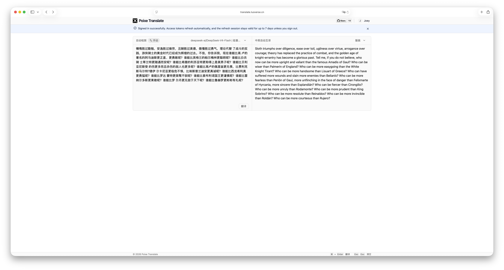

<div align="center">
  <a href="https://github.com/poixeai/translate">
    
  </a>
  <h1>Poixe Translate</h1>
  <p>A lightweight web translation tool powered by AI</p>

  English / [简体中文](./README_CN.md)

  <p>
    <a href="https://github.com/poixeai/translate/blob/main/LICENSE">
      
    </a>
    <a href="https://github.com/poixeai/translate">
      
    </a>
    <a href="https://github.com/poixeai/translate/stargazers">
      
    </a>
    <a href="https://github.com/poixeai/translate/issues">
      
    </a>
  </p>

  <h4>
    <a href="https://translate.poixe.com">Live Demo</a>
    <span> · </span>
    <a href="#quick-start">Quick Start</a>
    <span> · </span>
    <a href="#deploy">Deployment</a>
    <span> · </span>
    <a href="#model">Supported Models</a>
    <span> · </span>
    <a href="#language">Translation Languages</a>
  </h4>
  
  
</div>

---

Poixe Translate is an open-source web translation tool powered by AI large language models. Translation requests are still sent directly from the browser to your configured model provider, while the bundled Go backend handles authentication, admin APIs, encrypted provider key storage, and saved user preferences.

## Features

- **Browser-to-provider translation requests**: Translation requests go directly from the browser to your configured provider, helping keep model traffic under your control.
- **Server-backed authentication**: Includes login, refresh tokens, logout, and protected admin APIs for multi-user or managed deployments.
- **Encrypted provider credentials at rest**: Provider API keys are encrypted before they are written to the backend database.
- **Custom model providers supported**: You can define your own model providers by configuring the API Endpoint, API Key, API protocol, and model list, and switch freely between different models.
- **Supports 4 mainstream AI API protocols**: Easily connect to different AI service providers or compatible platforms with flexible extensibility.
- **Custom translation prompts supported**: Supports custom prompts, allowing users to tailor translation logic based on professional domains (such as legal, IT, or medical) or specific tones for highly accurate contextual translation.
- **Supports 186 translation languages**: Covers natural languages, regional language variants, dialects, ancient languages, and some constructed languages.
- **Supports 15 UI languages**: Suitable for global use and open-source distribution.
- **Theme switching**: Supports following the system theme as well as manual theme switching.
- **Local persistent storage**: Configuration data is stored via IndexedDB for a better user experience.

## Tech Stack

This project is built with a modern web technology stack to ensure high performance and a great developer experience:

- React
- Vite
- TypeScript
- shadcn/ui
- Tailwind CSS 
- Dexie.js (IndexedDB)
- Gin
- SQLite

## Quick Start <a id="quick-start"></a>

1. **Prepare backend secrets**: Copy `.env.example` values into your runtime environment and set `ADMIN_PASSWORD`, `JWT_SECRET`, and `ENCRYPTION_KEY` before starting the backend. Add `CORS_ALLOWED_ORIGINS` when your frontend and backend run on different origins during development.
2. **Start the application**: Use Docker Compose for the quickest full-stack setup, or run the frontend and backend separately.
3. **Sign in**: Open the app and sign in with the configured admin account.
4. **Configure a model provider**: Click the settings button in the upper-right corner to open the configuration panel, then add a model provider and fill in the Endpoint, API Key, choose the API protocol type, and enter the supported model list.
5. **Select a model and target language**: Choose the AI model you want to use, the language to translate into, and the translation prompt.
6. **Start translating**: Enter the text you want to translate in the input box and click the translate button to get the result.

> For the illustrated tutorial, see [User Guide (Illustrated)](docs/en/guild.md).

## Supported AI Models <a id="model"></a>

Poixe Translate currently supports 4 mainstream AI API protocols and can connect to platforms, model services, or self-hosted gateways compatible with these protocols.

### Supported API Protocols

| Name | Path | Official Documentation |
|---|---|---|
| OpenAI Chat Completions | `/v1/chat/completions` | [Official Docs](https://developers.openai.com/api/reference/resources/chat) |
| OpenAI Responses | `/v1/responses` | [Official Docs](https://developers.openai.com/api/reference/resources/responses/methods/create) |
| Anthropic Messages | `/v1/messages` | [Official Docs](https://platform.claude.com/docs/en/api/messages/create) |
| Google Gemini Generate Content | `/v1beta/models/{model}:generateContent` | [Official Docs](https://ai.google.dev/gemini-api/docs/text-generation?hl=zh-cn) |

### Compatible Model Services

As long as your provider is compatible with the protocols above, it can usually be connected, for example:

* OpenAI
* Anthropic Claude
* Google Gemini
* DeepSeek
* Grok
* Qwen
* Self-hosted compatible gateways
* Other model aggregation platforms

### Required Fields When Configuring a Model Provider

* Name
* API Endpoint
* API Key
* API Style
* Model List

This means you can freely switch between different model sources according to your needs without being locked into a single platform.

## Supported Translation Languages <a id="language"></a>

Poixe Translate currently supports **186 translation languages**, covering major global languages as well as many regional language variants, suitable for translation needs in daily communication, study, work, and professional scenarios.

Below are just some of the supported languages:

- English
- 简体中文
- 繁體中文
- 日本語
- 한국어
- Français
- Deutsch
- Español
- Português
- Русский
- हिन्दी
- Bahasa Indonesia
- Italiano
- Nederlands

> For the full language list, please refer to the actual supported content in the application.

## Deployment <a id="deploy"></a>

Poixe Translate is now a small full-stack app: the frontend is served by Nginx and the backend handles `/api` routes, authentication, encrypted provider storage, and persisted preferences.

### Docker Compose

1. Copy `.env.example` into your deployment environment and set secure values for `ADMIN_PASSWORD`, `JWT_SECRET`, and `ENCRYPTION_KEY`.
2. Start the stack:

```bash
docker compose up -d --build
```

The app will be available at `http://localhost:8080`.

### Docker

```bash
# Clone the source code
git clone https://github.com/poixeai/translate.git
cd translate

# Build the image
docker build -t poixeai/translate:latest .

# Run the container with required secrets
docker run -d \
  -p 8080:80 \
  --name poixe-translate \
  --restart=always \
  -e ADMIN_PASSWORD='replace-me' \
  -e JWT_SECRET='replace-with-a-long-random-secret' \
  -e ENCRYPTION_KEY='replace-with-a-long-random-secret' \
  poixeai/translate:latest
```

### Vercel or Static Hosting

The current authenticated build expects backend `/api` routes, so a frontend-only static deployment is no longer sufficient on its own. If you deploy the frontend separately, run the Go backend alongside it and proxy `/api` requests to the backend service.

### Manual Deployment

```bash
# Install frontend dependencies
npm install

# Build frontend assets
npm run build

# Run backend API
cd backend
go run .
```

Serve the generated `dist/` directory through any static web server and reverse-proxy `/api` traffic to the Go backend.

## Testing

```bash
npm run test
```

## Contributing

Issues and Pull Requests are welcome.

## License

This project is licensed under the [MIT License](./LICENSE).
