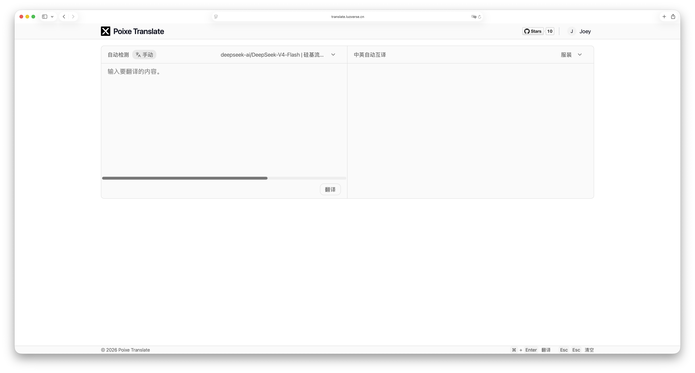

<div align="center">
  <h1>Poixe Translate (Rory Edition)</h1>
  <p>A lightweight, full-stack AI translation tool with multi-device sync</p>

  English / [简体中文](./README_CN.md)

  <p>
    <a href="https://github.com/its-rory/translate/blob/main/LICENSE">
      
    </a>
    <a href="https://github.com/its-rory/translate">
      
    </a>
    <a href="https://github.com/its-rory/translate/stargazers">
      
    </a>
    <a href="https://github.com/its-rory/translate/issues">
      
    </a>
  </p>

  <h4>
    <a href="#quick-start">Quick Start</a>
    <span> · </span>
    <a href="#deploy">Deployment</a>
    <span> · </span>
    <a href="#model">Supported Models</a>
    <span> · </span>
    <a href="#language">Translation Languages</a>
  </h4>
  
  
</div>

---

**Poixe Translate (Rory Edition)** is an enhanced version of the open-source web translation tool. It features a full-stack architecture with a Go backend and a React frontend, specifically optimized for private deployment, multi-device synchronization, and smarter auto-translation logic.

## Key Enhancements

- **Cloud Preference Sync**: Your selected models, custom prompts, and translation modes are now synced to the server. Log in from any device and your workspace is exactly how you left it.
- **Smart Auto-Translation**: Improved "ZH/EN Auto" mode. No need to manually select a target language on first use; the backend now intelligently handles language detection and switching.
- **Enhanced Reliability**: Fixed Docker execution path bugs and refined API validation rules for a smoother "out-of-the-box" experience.
- **Privacy First**: Translation requests go directly from your browser to the AI provider. Your API keys are encrypted at rest on your own server.

## Features

- **Server-backed Authentication**: Full JWT-based auth system (login, refresh tokens, session persistence).
- **Encrypted Provider Storage**: API keys are AES-encrypted before being stored in the SQLite database.
- **Custom Prompts**: Create specialized translation personas (Medical, Legal, Tech, etc.) that follow your account.
- **186 Languages**: Wide support for natural, regional, and ancient languages.
- **Modern UI**: Built with shadcn/ui and Tailwind CSS, supporting dark/light/system themes.

## Quick Start <a id="quick-start"></a>

1. **Start with Docker**: Run the pre-built image (see [Deployment](#deploy) section).
2. **Sign in**: Default credentials are `admin` / `admin` (can be configured via ENV).
3. **Configure Provider**: Add your API keys (OpenAI, SiliconFlow, Anthropic, etc.) in the settings.
4. **Translate**: Switch to "ZH/EN Auto" mode for the most seamless experience.

## Deployment <a id="deploy"></a>

This version is optimized for Docker + Nginx reverse proxy environments.

### Recommended Docker Run (with Persistence)

Replace `your-username` with your Docker Hub name or use the local image.

```bash
docker run -d \
  --name translate-app \
  --restart always \
  -p 8081:8081 \
  -v $(pwd)/translate-data:/app/data \
  -e ADMIN_PASSWORD='your-password' \
  -e JWT_SECRET='random-string' \
  -e ENCRYPTION_KEY='random-string' \
  itsrory/translate-app:latest
```

> **Note**: Always mount `-v $(pwd)/translate-data:/app/data` to ensure your settings and API keys survive container updates.

### Nginx Reverse Proxy & HTTPS (Cloudflare + Certbot)

For a professional setup like `https://translate.yourdomain.com`:

1.  **Nginx Config**:
    ```nginx
    server {
        listen 80;
        server_name translate.yourdomain.com;
        location / {
            proxy_pass http://127.0.0.1:8081;
            proxy_http_version 1.1;
            proxy_set_header Upgrade $http_upgrade;
            proxy_set_header Connection "upgrade";
            proxy_set_header Host $host;
        }
    }
    ```
2.  **SSL**: Run `sudo certbot --nginx -d translate.yourdomain.com`.
3.  **Cloudflare**: Set DNS to **Proxied (Orange Cloud)** and SSL to **Full (strict)**.

## Technical Stack

- **Frontend**: React, Vite, TypeScript, shadcn/ui, Tailwind, Dexie.js
- **Backend**: Go (Gin), SQLite, GORM

## Contributing

Pull requests and bug reports are welcome on the [GitHub repository](https://github.com/its-rory/translate).

## License

MIT License.
